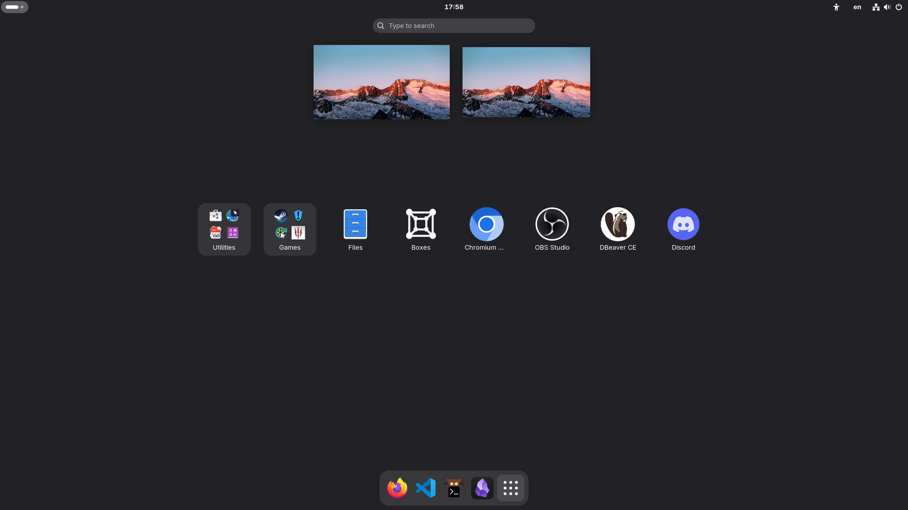

# TABLE OF CONTENTS

- [TABLE OF CONTENTS](#table-of-contents)
  - [content of this repository](#content-of-this-repository)
  - [requirements and dependencies](#requirements-and-dependencies)
    - [requirements](#requirements)
    - [dependency packages](#dependency-packages)
    - [install dependency packages with this one command](#install-dependency-packages-with-this-one-command)
  - [what does start.sh script do](#what-does-startsh-script-do)
  - [installation](#installation)
    - [install OhMyZsh](#install-ohmyzsh)
    - [install dotfiles](#install-dotfiles)
    - [install flatpak packages -- after reboot](#install-flatpak-packages----after-reboot)
    - [installing vscode and setting up global settings.json](#installing-vscode-and-setting-up-global-settingsjson)
  - [manual tasks that can not be automated](#manual-tasks-that-can-not-be-automated)
  - [optional tips you might want to consider](#optional-tips-you-might-want-to-consider)
  - [Q\&A why are you using both snap and flatpak?](#qa-why-are-you-using-both-snap-and-flatpak)
  - [DONATE](#donate)

## content of this repository

- VSCode profile / settings and workspaces as primary code editor.
  Setup with AI Agent and vim extension with LazyVim keybindings in mind for maximum productivity.
  [setup.sh](./vscode/setup.sh) sets up global vscode settings.json and snippets.
- dotfiles and configs managed by GNU/Stow - Kitty, Zsh, Cmus, gitconfig,
  and more.
- zsh functions.
- Various installation scripts.

## requirements and dependencies

### requirements

- Be on Ubuntu
- Bash -- Already preinstalled on Debian based distributions
- Gnome desktop environment installed and
  running -- needed for [slickgnome](https://github.com/monoira/slickgnome)
- Have ssh key configured w/GitHub to clone using ssh.

### dependency packages

- wget
- stow
- git

### install dependency packages with this one command

```bash
sudo apt install -y wget stow git
```

## what does start.sh script do

- Installs useful and necessary apt and snap packages
- Installs nerd font: Hack Nerd Font
- Installs lazygit
- Installs lazydocker
- Installs vimv
- Configures gnome settings with gsettings via [slickgnome](https://github.com/monoira/slickgnome)

And possibly more.
For full info, check scripts themselves at
[start.sh](./start.sh)
and
[install_scripts](./install_scripts/) directory

## installation

### install OhMyZsh

```bash
sudo apt install -y zsh
```

```bash
sh -c "$(wget https://raw.githubusercontent.com/ohmyzsh/ohmyzsh/master/tools/install.sh -O -)"
```

```bash
git clone https://github.com/zsh-users/zsh-autosuggestions ${ZSH_CUSTOM:-~/.oh-my-zsh/custom}/plugins/zsh-autosuggestions
```

```bash
git clone https://github.com/zsh-users/zsh-syntax-highlighting.git ${ZSH_CUSTOM:-~/.oh-my-zsh/custom}/plugins/zsh-syntax-highlighting
```

### install dotfiles

```bash
wget -qO- https://raw.githubusercontent.com/monoira/.dotfiles/main/start.sh | bash
```

### install flatpak packages -- after reboot

```bash
flatpak install -y flathub \
  com.discordapp.Discord \
  com.heroicgameslauncher.hgl \
  org.vinegarhq.Sober
```

### installing vscode and setting up global settings.json

1. open vscode - required so `$HOME/.config/Code/User` gets created
2. import [vscode profile](./vscode/profiles)
3. clone and open workspaces
4. run following script to symlinking vscode global settings.json, which includes vscode-vim extension keybindings

```bash
ln -sf "$HOME/.dotfiles/vscode/settings.json" $HOME/.config/Code/User/settings.json
```

**When everything finishes, reboot your system! VERY IMPORTANT!**

## manual tasks that can not be automated

- change refresh rate in `settings > refresh rate` to 155 Hz
- add a keyboard layout
- in `about:config` of firefox, change these:
  - `full-screen-api.warning.timeout` to `0`
  - `extensions.pocket.enabled` to `false`
- `Software & Updates > Updates > Automatically check for updates` to `never`
- add [Vim extension to Dbeaver manually](https://www.youtube.com/watch?v=soznrFTtL2s)
- place packages based on the following image:
  

## optional tips you might want to consider

- pause auto update / refresh of all snap packages

```bash
sudo snap refresh --hold
```

- use latest lts version of nodejs and npm via nvm

```bash
nvm install --lts && nvm use --lts
```

## Q&A why are you using both snap and flatpak?

I tried to only use flatpak, but had some problems with following packages

- steam

Installing via flatpak or apt steam-installer didn't worked, since
it kept giving me unmet dependencies error.
Building .deb package with "dpkg -i" means it won't update.
I WILL CHECK LATER. Until then, I have to use snap version.

I would love to only use flatpak and get away from snap,
But it is what it is.
I will re-check in the future if I can replace those packages
with non-snap versions and finally be snap-free.

- neovim

Neovim in apt is severely outdated, PPA version is outdated and
flatpak version is TERRIBLE, buggy and overly sandboxed.
Building .deb package with "dpkg -i" means it won't update.

## DONATE

I've been creating FOSS / GNU/Linux / nvim / web
related software for some time now.  
If you used, forked or took code from one of my projects and you
would like to support me 👍,  
you can donate here:

| type                | address                                    |
| ------------------- | ------------------------------------------ |
| Bitcoin (SegWit)    | bc1ql8sp9shx4svzlwv0ckzv8s7pphw5upvmt8m2m7 |
| Ethereum (Ethereum) | 0xf2FCB0Af39DF7A608b76297e45181aF23fEB939F |
