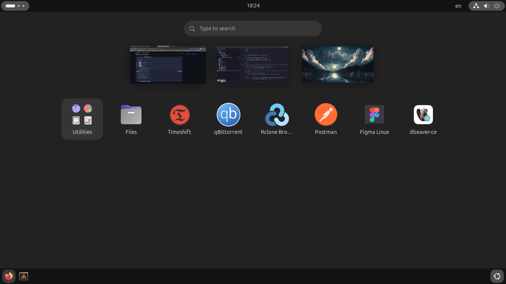

# What I keep in this repository

<!--toc:start-->

- [What I keep in this repository](#what-i-keep-in-this-repository)

  - [HOW TO SETUP](#how-to-setup)
    - [Requirements / required packages](#requirements-required-packages)
      - [INSTALLATION METHOD 1 - Auto installation (Recommended)](#installation-method-1-auto-installation-recommended)
        - [What this script does](#what-this-script-does)
      - [INSTALLATION METHOD 2 - Manual installation](#installation-method-2-manual-installation)
  - [Tasks you have to do manually because of certain problems](#tasks-you-have-to-do-manually-because-of-certain-problems)
  - [How to uninstall](#how-to-uninstall)
  <!--toc:end-->

- dotfiles - Neovim, Alacritty, Zsh and gitconfig configurations.
- VSCode settings & workspaces
- bash aliases
- Scripts that install them

## HOW TO SETUP

### Requirements / required packages

- Ubuntu or any Debian based distribution with snap and
  gnome desktop environment installed
- Bash (Already preinstalled on Debian based distributions)
- sh (Already preinstalled on Debian based distributions)
- Git
- Wget

#### INSTALLATION METHOD 1 - Auto Installation (Recommended)

METHOD SPECIFIC REQUIREMENTS:

Must have ssh key and be signed up to Github with it
since this uses git clone with ssh

```bash
wget -qO- https://raw.githubusercontent.com/monoira/.dotfiles/main/start.sh | bash
```

##### What this script does

- Download useful and necessary apt and snap packages
- Download nerd font: Hack nerd font in my case ( Changeable in script )
- Download and compile lazydocker
- Download and compile lazygit
- Download vimv
- Configure gnome settings with gsettings to:
  hide trash on dash-to-dock, hide home, disable notifications, etc.

When script finishes, reboot your system.

#### INSTALLATION METHOD 2 - Manual installation

METHOD SPECIFIC REQUIREMENTS:

You MUST clone this repository with submodules at ~/ using one of the following commands

SSH cloning

```bash
git clone --recurse-submodules git@github.com:monoira/.dotfiles.git ~/.dotfiles
```

HTTPS cloning

```bash
git clone --recurse-submodules https://github.com/monoira/.dotfiles.git ~/.dotfiles
```

After which run this script: [install.sh](./install.sh)
to automate following tasks:

- Download useful and necessary apt and snap packages
- Download nerd font: Hack nerd font in my case ( Changeable in script )
- Download and compile lazydocker
- Download and compile lazygit
- Download vimv
- Configure gnome settings with gsettings to:
  hide trash on dash-to-dock, hide home, disable notifications, etc.

When script finishes, reboot your system.

- Run this to create and spread around dotfile symlinks
  [create_symlinks.sh](./create_symlinks.sh)

## Tasks you have to do manually because of certain problems

- Oh-My-Zsh installation

  ```bash
      sh -c "$(wget https://raw.githubusercontent.com/ohmyzsh/ohmyzsh/master/tools/install.sh -O -)"
  ```

  ```bash
      git clone https://github.com/zsh-users/zsh-autosuggestions ${ZSH_CUSTOM:-~/.oh-my-zsh/custom}/plugins/zsh-autosuggestions
  ```

  ```bash
      git clone https://github.com/zsh-users/zsh-syntax-highlighting.git ${ZSH_CUSTOM:-~/.oh-my-zsh/custom}/plugins/zsh-syntax-highlighting
  ```

- Add a keyboard layout
- Place packages based on the following image:
  

## How to uninstall

```bash
wget -qO- https://raw.githubusercontent.com/monoira/.dotfiles/main/uninstall.sh | bash
```

Warning: this will remove aka rm -rf

~/.bashrc
~/.zshrc
~/.zsh_aliases
~/.gitconfig
~/.config/nvim
~/.config/alacritty
~/.config/tmux

And possibly more
for full info on what [uninstall.sh](./uninstall.sh) will remove,
check [uninstall.sh](./uninstall.sh) script itself.
